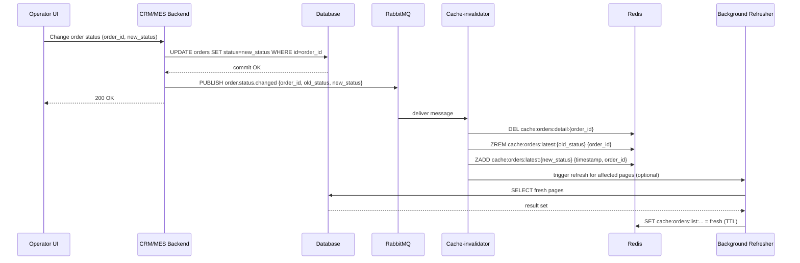

# Архитектурное решение по кешированию

Стратегия кеширования для системы «Александрит» (онлайн-магазин, CRM, MES). Цель — снизить задержки UI (особенно дашборда MES), уменьшить нагрузку на БД и ускорить ответы на частые запросы при одновременном сохранении корректности данных.

## Мотивация

- Операторы жалуются на медленную первую страницу MES — дашборд с фильтрами и сортировкой, раньше показывал все заказы и тормозил.
- MES выполняет тяжёлые расчёты и одновременно генерирует много запросов к БД/фронту; необходимо снизить нагрузку и дать быстрый UX (показать самые новые заказы). 
- При росте нагрузки (входящие API и внешние партнёры) без кеша БД становится узким местом.

Ключевые метрики, которые хотим улучшить:

- Среднее время ответа страницы MES (target < 1s для первой страницы).
- Нагрузка на БД (QPS на read) — уменьшить на 50% для dashboard-паттернов.
- Процент попаданий в кеш (cache hit rate) — целевой > 70% для списков заказов.

## Что кешировать (приоритеты)

1. Списки заказов для дашборда MES (фильтры по статусам, сортировка по дате) — высокоприоритетно.
2. Детали заказа (order detail view) — средний приоритет, часто запрашиваемы для конкретных заказов.
3. Результаты расчёта стоимости (если входные данные идентичны) — осторожно: только если hash входной 3D-модели совпадает.
4. Частые справочники/конфигурации (catalogs, lookup) — низкий приоритет, долгий TTL.

## Выбранный паттерн кеширования

Комбинация паттернов:

- Cache-Aside для списков заказов и деталей: приложение читает кеш, при промахе — читает БД и записывает кеш.
- Write-Through для справочников/настроек, где важно, чтобы кеш всегда обновлялся при записи.
- Refresh-Ahead / Background refresh для дашборда: когда TTL близок к концу, запускать фоновую задачу на обновление кеша.

Причины:
- Cache-Aside прост в реализации и даёт контроль над неустойчивыми записями (инвалидация при изменении статуса).
- Для долгих расчётов лучше сохранять результаты по ключу-хешу; Write-Through не нужен, потому что расчёт инициируется одним компонентом (MES) и результат может быть записан в БД+кеш после завершения.

## Технология и инфраструктура

- Redis (primary) — in-memory store, поддержка TTL, sorted sets, pub/sub, streams. Использовать как кэш и как быстрый store для dashboard/top-N.
- Redis Cluster или managed Redis (Yandex) для устойчивости и масштабирования.
- В приложении использовать библиотеку-клиент с локальным L1-кешем (optional) и Redis как L2.
- Для фоновых обновлений использовать отдельные worker-процессы (например Celery/Sidekiq/RabbitMQ consumers).

## Инвалидация и координация

Ключевая сложность — гарантия, что при изменении статуса (например, PRICE_CALCULATED, MANUFACTURING_STARTED) кеши корректно инвалидаются.

Механизмы инвалидации:

1. События через RabbitMQ: при изменении статуса сервис публикует событие `order.status.changed` с payload {order_id, old_status, new_status, timestamp}. Слушатель (cache invalidator) подписывается и удаляет/обновляет ключи Redis (detail + relevant lists).

2. Прямой вызов: сервисы, которые изменяют данные (CRM/MES), после успешной записи в БД вызывают endpoint (или локальную функцию) для удаления соответствующих кешей (atomic ops).

3. TTL: резервная автоматическая очистка по времени — защитный слой.

4. Optimistic concurrency: при записи в кеш использовать CAS-паттерн (compare-and-set) или version поля (order.version) — чтобы не перезаписывать более новые данные.

Пример инвалидационных шагов при смене статуса:

1. MES/CRM сохраняет новый статус в БД.
2. В транзакции/после успешного commit публикует `order.status.changed` в RabbitMQ.
3. Cache-invalidator (consumer) получает сообщение и:
   - Удаляет `cache:orders:detail:{order_id}`
   - Удаляет/обновляет соответствующие страницы `cache:orders:list:*` (можно пометить и триггерить background refresh для affected pages)
   - Обновляет sorted set `cache:orders:latest:{old_status}` и `cache:orders:latest:{new_status}` (zrem/zadd)

Эта модель даёт асинхронную, но быструю инвалидацию и хорошо сочетается с существующей очередной архитектурой (RabbitMQ).

## Стратегия инвалидации кеша — предлагаемый подход

Рекомендуется гибридная стратегия, сочетающая три механизма:

1. Event-based (key-based) invalidation — первичный механизм: при изменении статуса/данных публикуется событие `order.status.changed`, на которое подписывается cache-invalidator и удаляет/обновляет конкретные ключи в Redis.
2. TTL (time-based) — резервный механизм: у всех списков и деталей установлен короткий TTL (dashboard lists 30s–2m, details 5m–30m). Это защищает от редких ошибок инвалидации и уменьшает вероятность устаревших данных.
3. Programmatic refresh (refresh-ahead) — для hot-pages: background refresher периодически обновляет кеш за счёт чтения БД до истечения TTL, гарантируя, что пользователи увидят свежие данные без просадок по latency.

- Event-based инвалидация даёт минимальную задержку между изменением в БД и удалением кеша — это важно для корректности данных и минимизации window of inconsistency.
- TTL служит защитным слоем на случай пропущенных событий (consumer crashed, network blip). Короткий TTL поддерживает eventual consistency.
- Refresh-ahead уменьшает вероятность cache-miss storm и даёт стабильный UX при высоком трафике.

Причины не использовать один из вариантов:

- Только TTL (time-based) → потребует очень коротких TTL для адекватной свежести, но это снизит эффективность кеша и увеличит нагрузку на БД.
- Только event-based → надёжно, но риск потерь (если consumer упал) и сложность наблюдаемости/повторной доставки; требует хорошей гарантии доставки сообщений.
- Только refresh-ahead → сложнее реализовать и потребует точного тюнинга; не покрывает сценарий немедленного обновления при write.

## Сравнительный анализ стратегий инвалидации

| Стратегия | Плюсы | Минусы | Рекомендация для Александрит |
|---|---:|---|---|
| Time-based (TTL) | Простота реализации; не требует очередей | Требует коротких TTL для свежести → высокий load; window of staleness | Подходит как запасной слой, но не как единственный механизм |
| Key-based (event-driven) | Быстрая локализованная инвалидация; минимизирует window of inconsistency | Требует надёжной доставки событий; сложнее отлаживать | Основной механизм: подходит при наличии RabbitMQ |
| Programmatic refresh (refresh-ahead) | Снижает количество промахов; улучшает UX для hot pages | Требует дополнительных воркеров и логики; риск race conditions | Рекомендую для dashboard (hot pages) вместе с event-based |
| Full purge (flush all) | Простота при критических ошибках | Очень дорого; приводит к нагрузке на БД и временному падению UX | Не рекомендуется, только как аварийный инструмент |

## Sequence: изменение статуса заказа (write -> invalidate)

Последовательность надежного коммит-публишинг (write -> publish) и асинхронной инвалидацию кеша через consumer; background refresher поддерживает свежесть горячих страниц.

